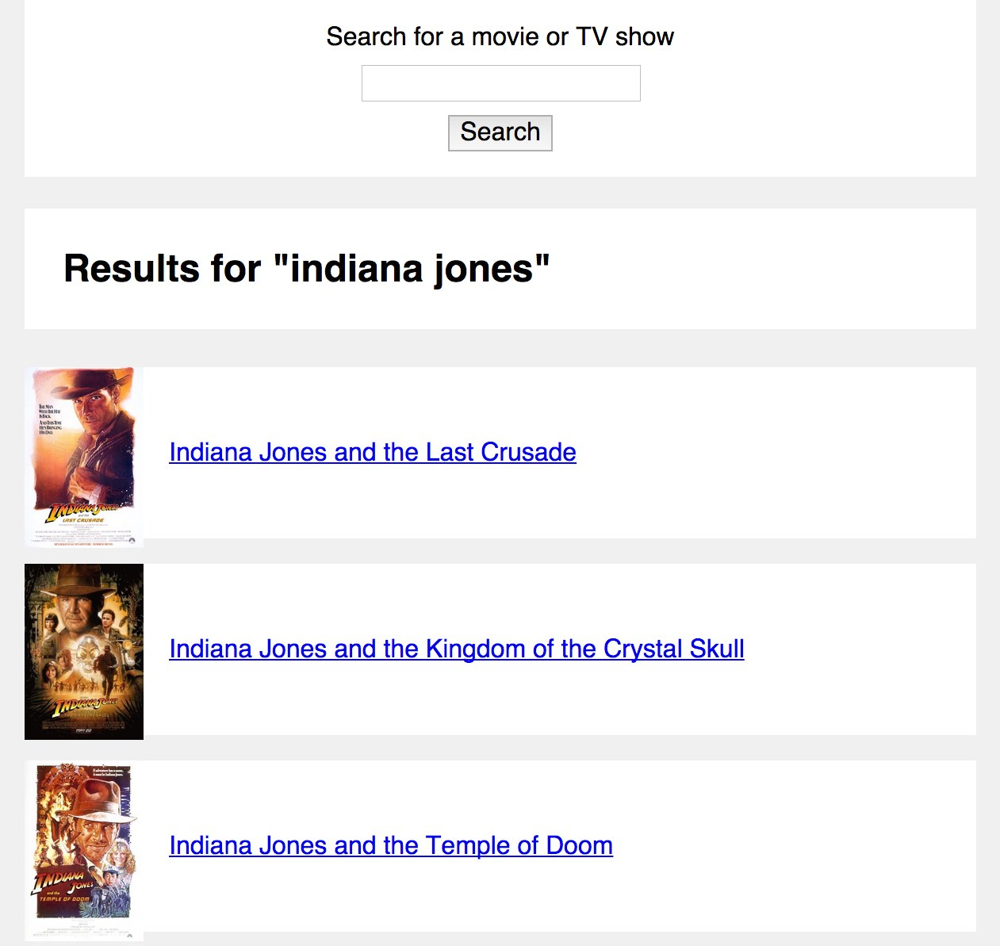

# An isomorphic Dart app

An isomorphic web app using Dart and React. Search for and list information about movies and TV shows. Checkout the working demo [here][demo].

[][demo]

## Features

* [x] *Server side rendering.* All entry points are rendered using React components. These entry points include:
  * `/`
  * `/search`
  * `/search/?q=:movie_name`
  * `/movie/:imdb_id`
* [x] *Progressive enhancement.* The app doesn't require client-side Dart or JS to function. All search fields and links will work in cases where the client-side code is still downloading, or the user has disabled JS.
* [x] *History API.* Client updates the browser's history API on screen transitions, and responds to history changes.
* [x] *Isomorphic routing.* The same routing code is used on the server and client.

## Architecture

### Initializing the client from server state

When the client is initialized, React replaces the DOM provided by the server. In order for the client to render the same DOM as the server, it needs to have the same state the server used for rendering. To do this, the server writes the state as a JSON object in a script tag. The client reads the JSON from the script tag and uses it to render the DOM.

### Rerendering state changes

DOM rendering is treated as a stateless function, with the `State` object being used to represent the view's state. `State` objects are passed to an `ApplicationView` component which it uses for generating the DOM.

To trigger state changes, a `StreamController` is passed to the `ApplicationView` which it adds `Action`s onto whenever a user interacts with the app. An action is a closure that is passed the current state and returns a new state. The application listens to the actions added to the stream controller, applies them, and rerenders the view. You can think of this as an endless loop of `Render -> User Action -> State Modification -> Render`.

### Dependencies on `dart:html` and `dart:io`

So we can reuse our React components on the client and server, special care needs to be given so they don't depend on `dart:html` or `dart:io`. In this case, the application requires network calls to an external movies API, which depending on the environment requires either the `io` or `html` libraries. To solve this, the `MoviesApi` uses factories for generating the appropriate request objects depending on if we're in a server or browser environment.

## Running

### App Engine (default)

Take a look at Dart's AppEngine [guide](https://www.dartlang.org/server/google-cloud-platform/app-engine/) for setting up Docker and AppEngine for Dart.

* Run `gcloud preview app run app.yaml`

### Without App Engine

* Run `dart bin/server.dart --no-app-engine`
* Open `http://localhost:8080` in your browser

[demo]: http://isomorphic-dart-demo.appspot.com
